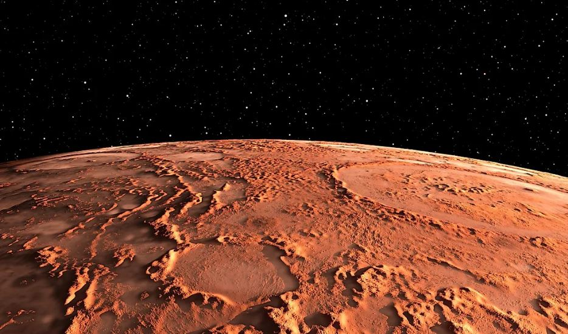
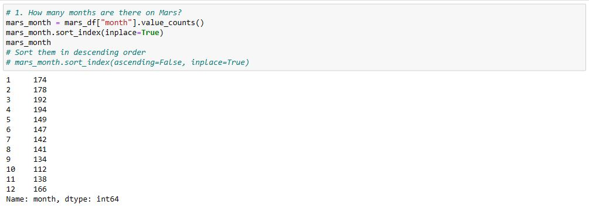
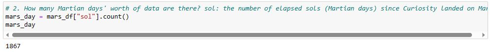
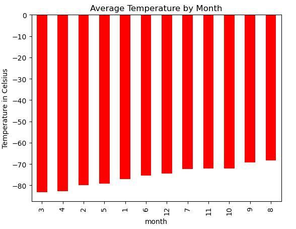
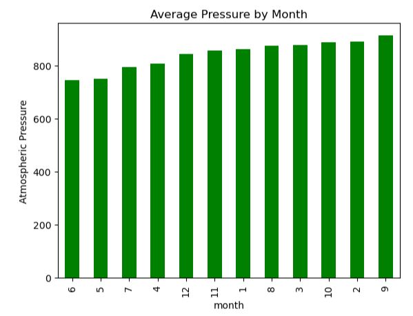
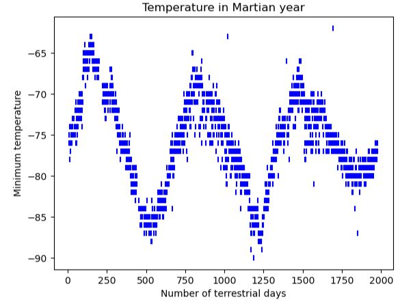

# Mars Data Scraping and Analysis

## Introduction
Embarking on Mars data exploration! Using Jupyter Notebooks, I'll scrape Mars news and weather details. Firstly, I'll extract titles and preview text from the Mars News site using Beautiful Soup. Then, I'll dive into Mars weather data, analysing temperatures, atmospheric pressure, and more. Excited to uncover insights from Mars-related sources and deepen my web scraping skills! Let's start this Martian adventure!

## Source of Data
* mars_data.csv
* https://static.bc-edx.com/data/web/mars_news/index.html

## Findings

1. How many months exist on Mars?

* The data provides a distribution of the Martian months based on the number of times each month appears in the dataset. The counts indicate the frequency of data recorded for each month. For instance, month 1 appears 174 times, indicating its prevalence in the dataset. So, there ar 12 months in mars.
   
2. How many Martian (and not Earth) days worth of data exist in the scraped dataset

* The dataset contains records of data collected on Mars over a period of time, each marked by the "sol" value representing the number of Martian days since Curiosity landed. The calculated count of Martian days, which is 1867, represents the extent of data available. This value indicates the duration of observation captured in Martian days, allowing us to determine the span of time for which data has been collected on the planet
   
3. What are the coldest and the warmest months on Mars (at the location of Curiosity)?

* The calculated mean minimum temperatures for each month at Curiosity's location on Mars are presented. This analysis aids in identifying the coldest and hottest months experienced on the planet. The values, ranging from approximately -83.31°C to -68.38°C, depict the monthly variations in minimum temperatures. On average, the third month has the coldest minimum temperature on Mars, and the eighth month is the warmest as indicated in the bar chart above. But it is always very cold there in human terms!
    
4. Which months have the lowest and the highest atmospheric pressure on Mars? 

* This data showcases the average atmospheric pressures for each month at Curiosity's location on Mars. By analysing these pressure values, we can identify the months with both the lowest and highest atmospheric pressures. The range of values, spanning from around 745.05 hPa to 913.31 hPa, highlights the fluctuations in atmospheric pressure on Mars throughout the year. Atmospheric pressure is, on average, lowest in the sixth month and highest in the ninth. As show in the bar chart above. This analysis aids in understanding the variations in Mars' atmospheric conditions, allowing us to pinpoint the months characterised by extreme low and high atmospheric pressures.

5. About how many terrestrial (Earth) days exist in a Martian year? 

* The distance from peak to peak is roughly 1425-750, or 675 days. A year on Mars appears to be about 675 days from the plot. Internet search confirms that a Mars year is equivalent to 687 earth days.

## Conclusion
In this analysis of Martian climate data, several intriguing findings have been uncovered, shedding light on the unique climate patterns and variations on the Red Planet:

1. **Martian Months and Seasons**: The dataset provides evidence of the Martian calendar, confirming the presence of twelve months on Mars. Each month appears to have relatively consistent data coverage, allowing us to observe the seasonal changes over a Martian year.
2. **Martian Days of Data**: A total of 1867 Martian days' worth of data have been collected and analysed. This extended observation period grants us valuable insights into the long-term climate patterns on Mars and its year-round variations.
3. **Temperature Extremes**: The calculated mean minimum temperatures for each month highlight the extreme cold conditions on Mars. The third month experiences the coldest temperatures, while the eighth month is relatively warmer. Mars' frigid climate contrasts starkly with Earth's temperate zones, underscoring the challenging conditions faced by any potential future missions.
4. **Atmospheric Pressure Fluctuations**: The analysis of average atmospheric pressure reveals significant monthly fluctuations. The sixth month has the lowest atmospheric pressure, while the ninth month boasts the highest. These variations may be attributed to Mars' unique atmospheric composition and geographical features.
5. **Mars Year Duration**: By analysing the Martian year's duration, we've determined that a year on Mars is roughly 675 Earth days long. This stark contrast to Earth's 365-day year showcases Mars' distinct orbit around the Sun and emphasises its longer seasonal cycle.

Comparing Mars' climate to Earth's climate underscores the profound differences between the two planets. Mars' thin atmosphere, extreme cold temperatures, and unique geological features create an environment that is vastly different from our home planet. As we continue to explore and study Mars, these insights contribute to our understanding of the intricacies of planetary climates and the challenges inherent in potential future Mars missions.
